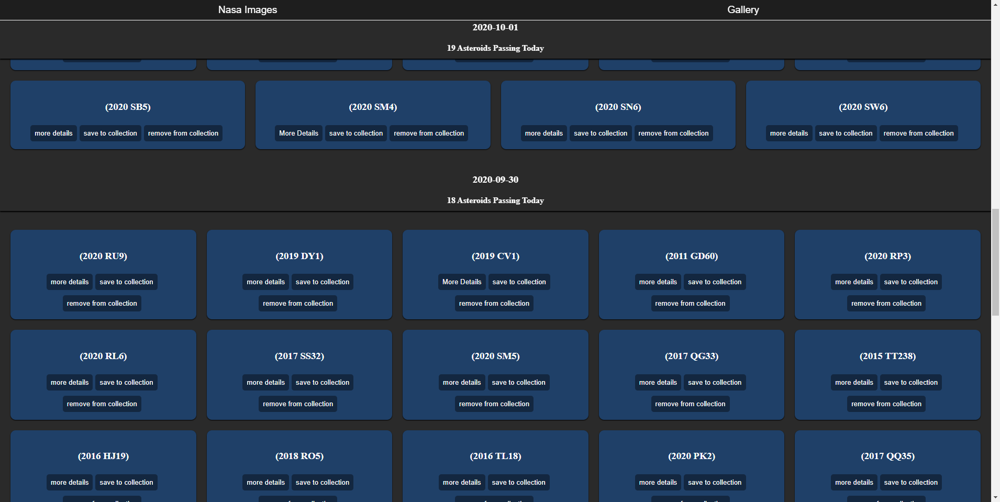
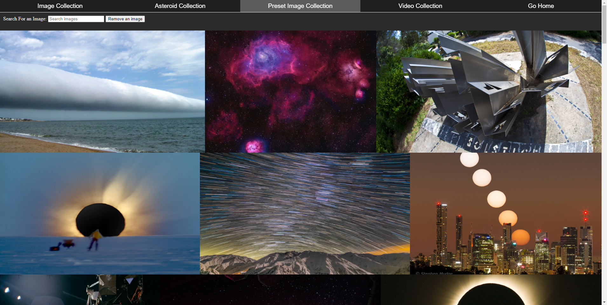

# NASA APi Website project

## Summary

This project is designed to fetch information from  NASA's astronomical picture of the day and asteroid api and be able to collect them in a gallery using IndexedDb to view at a later date.

I wanted to do this as [NASA's APOD](https://apod.nasa.gov/apod/astropix.html) website is limited with very little features apart from viewing the daily pictures. I added features such as being able to save information you are interested in into a collection without having to try to remember the date of the image, video or asteroid later on. I also added an infinte scroll into the asteroid api making it easy to look through asteroids on the past few days quickly.

## Table of content
1. [What I used in this project](#What-I-used-in-this-project)
    1. [languages](#languages)
    2. [References used](#References-used)
2. [Parts of the Website](#Parts-of-the-website)
    1. [Daily images page](#daily-images-page)
    2. [Asteroid page](#asteroid-page)  
    3. [Gallery](#gallery)
    4. [Modal Window](#modal-window)
3. [Issues I had and changes I made](#Issues-I-had-and-changes-I-made)
4. [Improvements](#Improvements)

## What I used in this project

### Languages
1. Vanilla JavaScript
    1. indexedDb (Gallery)
    2. intersectionObservers (Asteroid API)
2. HTML
3. CSS

### References used
* [Adaptive Photo Layout with Flexbox](https://css-tricks.com/adaptive-photo-layout-with-flexbox/)
* [Remove the X from Internet Explorer and Chrome input type search](https://blog.maximerouiller.com/post/remove-the-x-from-internet-explorer-and-chrome-input-type-search/)

## Parts of the Website
### Daily Images Page

[Daily Image Page Link](https://pudderz.github.io/SpaceWebsite/index.html)
#### How it works
Uses the NASA APOD API to show NASA's daily image and information about the image. I also used a date input to allow the user to select a date of their choosing going back to 1995 as well as next day and previous day buttons to speed up the process of selecting a new date.

### Asteroid Page

[Asteroid Page Link](https://pudderz.github.io/SpaceWebsite/asteroidPage/asteroidList.html)
#### How it works
Displays a collection of asteroids that will pass by the earth on a certain day. I used the intersection Observer here to be able to show previous days as you scroll down. There is also a save button which will save the asteroid's and its information such as speed, size and time of closest approach to your asteroid collection in the gallery.

### Gallery/collection

[Gallery Page Link](https://pudderz.github.io/SpaceWebsite/gallery/usersCollection.html)
#### How it works
The gallery gets all key value pairs in the indexedDB objectStores and displays the information in a responsive format on the screen in different tabs for each objectStore. 

I also created a preset image collection which automatically is created when you join the website with preset images. You can use this to freely test out the features such as searching, removing image on the page or viewing the images in the modal window.  
 
### Modal Window

I Created a modal window when you click on images in the home page and image galleries. This gives a better view of the image with specific options such as switching the image from SD to HD, deleting the image if its in the gallery from the object store and enter a fullscreen mode where the image fits the whole page and you can rotate the image to fit the whole screen.

## Issues I had and changes I made
 
### Tainted canvas (blobbed images)
At the start I wanted the option to be able to download these images offline. However I quickly learnt that canvases can be tainted if it has a loaded image from a different orgin and a Access-Control-Allow-Origin header has not been set up. This is a security feature and stopped me in my tracks so I just stored the information and the image Urls in the objectstores to display the gallery with.

### SVG Image animation
I originaly used SVG animation for a menu button using anime.js, however I found it wasn't needed and did not fit with the page design and content.

### Responsive Gallery
When I made the original responsive layout I divided my images into 4 div elements which responsively moved when the picture got narrower via flex and flex-wrap. However the images were normally different sizes causing each div to have a different height. This caused problems as each new line of the flex display had to start at the same height creating gaps between some div elements when stacked 2x2. In the end I used a list of images which stretches in size using flex-grow and making each image max size only cover its li tag and using object-fit:cover so the images would not shrink or overfill and leave gaps. I made this responsive by only changing the width and height of the li tags as the page got smaller.

### Videos
Mid way through building the site I discovered that the NASA picture of the day can also sometimes be a video instead resulting in no image being shown on the page. This was an easy issues to fix by creating a seperate iframe and objectStore for the videos to be presented in. 

## Improvements

### Next time I would like to:

* Use React to render the UI and perhaps create a single page application. This would decrease the amount of .appendChild() and .createElement() I use to load the infomation on certain pages.

* Recycle the DOM on the asteroid page to decrease the size of the DOM and save memory. This would allows the page to re-use DOM elements removing the ones that are far away from the viewport as low end devices can get slower if not completely unusable if the website has too big of a DOM to manage.

* Have lazy loading support on all devices. Currently I just set the loading attribute on images and iframes in the gallery to lazy, however this feature is [not supported in most browsers](https://caniuse.com/loading-lazy-attr) at the time of writing. Next time I would like to use the intersection observer to lazy load the images and iframes to support most browsers, still [intersectionObservers are not fully supported](https://caniuse.com/intersectionobserver) so I would need to use a polyfill or babel as well to get around this.
